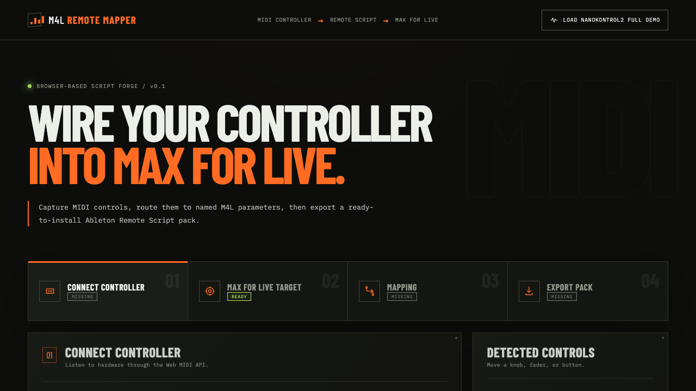
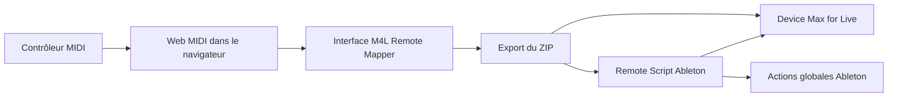
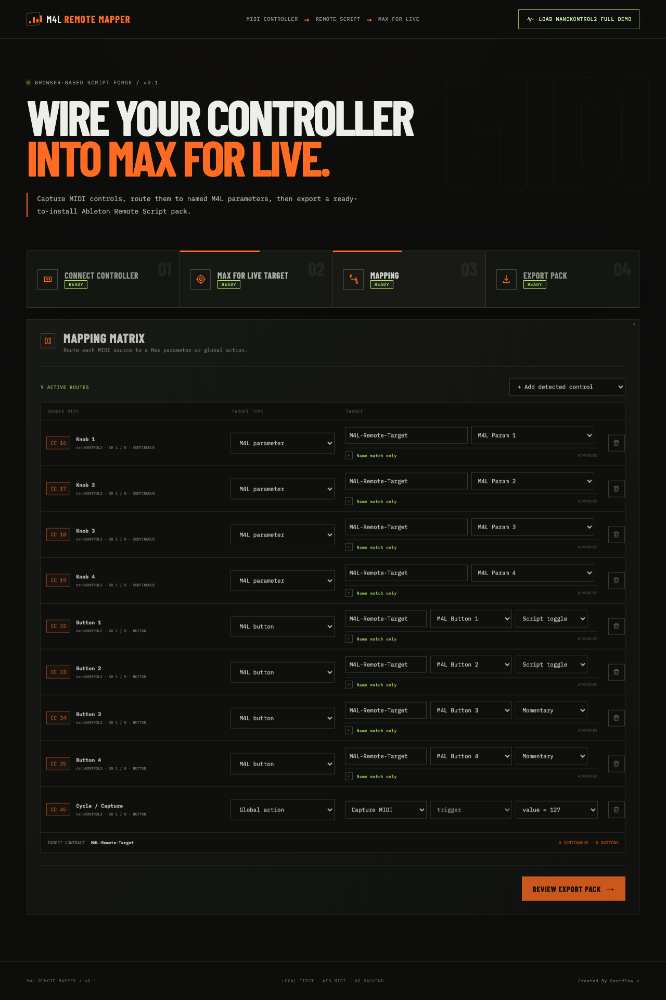
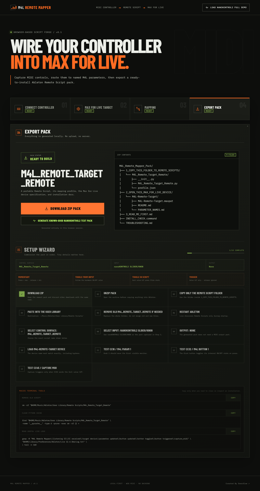

# M4L Remote Mapper

Créer des Remote Scripts Ableton pour Max for Live depuis le navigateur.

[](https://react.dev/)
[](https://vite.dev/)
[](https://www.ableton.com/live/)
[](https://www.ableton.com/live/max-for-live/)
[](https://developer.mozilla.org/docs/Web/API/Web_MIDI_API)
[](tests/)
[](LICENSE)

[English](README.md) · [Installation Ableton](docs/ABLETON_INSTALLATION.md) · [Dépannage](docs/TROUBLESHOOTING.md)



M4L Remote Mapper est un outil web qui capture les messages MIDI CC d'un contrôleur, les associe à des paramètres ou boutons Max for Live — ou à des actions globales Ableton — puis exporte un pack Remote Script prêt à installer.

Tout fonctionne localement dans le navigateur : aucun backend obligatoire, aucun compte et aucun envoi des données MIDI.

## Qu'est-ce que M4L Remote Mapper ?

L'application transforme un profil de contrôleur en deux éléments complémentaires :

1. un Remote Script Ableton qui écoute les CC configurés ;
2. un template Max for Live dont les paramètres portent exactement les noms attendus.

Elle automatise la génération Python, la structure du ZIP, les aliases de paramètres, le diagnostic d'installation et la documentation. L'objectif est de rendre les Remote Scripts accessibles aux musiciens et créateurs Max for Live qui ne veulent pas écrire tout le boilerplate à la main.

## Pourquoi ?

Le MIDI Map de Live est très pratique pour une assignation rapide, mais un mapping réutilisable demande davantage de structure. Les Remote Scripts sont puissants, pourtant le forwarding MIDI, le nommage des paramètres et l'installation sont faciles à casser.

M4L Remote Mapper sécurise ce pipeline :

- un `EncoderElement` et un `add_value_listener` par CC ;
- aliases Long Name, Short Name et Scripting Name ;
- séparation stricte entre paramètres continus et boutons ;
- fallback par index désactivé par défaut et contrôlé par type ;
- adaptation de 0–127 au véritable range Ableton ;
- logs lisibles, `BUILD_ID` déterministe et vérificateur d'installation.

## Fonctionnement



## Fonctionnalités

- Capture Web MIDI des Control Change
- Contrôles continus avec scaling min/max
- Boutons MIDI
- Modes Momentary, Input Toggle, Script Toggle et Trigger
- Aliases Long/Short/Scripting Name
- Vérification stricte Param/Button
- Fallback par index désactivé par défaut
- Action globale Capture MIDI
- Export ZIP dans le navigateur
- Setup Wizard après export
- `INSTALL_CHECK.command` pour macOS
- Troubleshooting et commandes Log.txt
- Pack de test nanoKONTROL2 connu-bon
- Template Max Audio Effect stéréo transparent
- Ableton Device Mapper séparé pour les instruments et effets natifs de Live
- Étape Custom Layout M4L avec knobs, faders, boutons, Learn MIDI, cibles et modes latch en temps réel
- Catalogue Live 12.4.5b6 de 83 devices et 2 746 paramètres

## Ableton Device Mapper

Ouvrir `/ableton-device-mapper` ou choisir **Ableton Device Mapper** dans la navigation principale pour créer un Remote Script destiné à un device natif : Operator, Wavetable, Drift, Simpler, Auto Filter, EQ Eight, Roar, Hybrid Reverb, Arpeggiator, etc.

Le Builder intégré en six étapes comprend un créateur visuel **Custom Layout** avec knobs, faders et boutons animés par le MIDI. Le sélecteur visible **UI · NORMAL / TERMINAL** dans le header change de renderer sans perdre le layout ni les assignations.

Contrairement au workflow Max for Live, cette vue ne demande aucun patch cible. L'utilisateur choisit un device et ses paramètres catalogués, applique un layout de contrôleur, puis exporte `Ableton_Device_Mapper_Pack`. Le script cherche d'abord sur la piste sélectionnée, puis dans toutes les pistes, retours, racks imbriqués et la piste Master. Le device est reconnu par son nom visible ou sa classe Live.

Le preset Operator Musical 8 commence ainsi :

| Source MIDI | Paramètre Operator |
| --- | --- |
| CC16 | Volume |
| CC17 | Tone |
| CC18 | Filter Freq |
| CC19 | Filter Res |

Les aliases sont prioritaires ; le fallback par index du catalogue reste désactivé par défaut. Les valeurs continues sont adaptées au minimum et au maximum réels du paramètre natif.

Voir [Ableton Device Mapper](docs/ABLETON_DEVICE_MAPPER.md) pour le contrat du catalogue, les presets, le ZIP et l'installation.

## Captures

Les captures des six écrans sont disponibles dans [docs/assets/screenshots](docs/assets/screenshots/) et peuvent être régénérées avec `npm run docs:screenshots`.





## Démarrage rapide

Prérequis : Node.js, un navigateur Chromium compatible Web MIDI, Ableton Live avec Max for Live et un contrôleur MIDI.

```bash
cd client
npm install
npm run dev
```

Puis :

1. Ouvrir l'URL locale affichée par Vite.
2. Cliquer sur **Enable MIDI** et autoriser l'accès MIDI.
3. Sélectionner l'entrée du contrôleur.
4. Bouger les potentiomètres, faders ou boutons à détecter.
5. Définir la cible Max for Live.
6. Créer les mappings.
7. Exporter le ZIP.
8. Suivre le Setup Wizard et `3_READ_ME_FIRST.md`.

Pour vérifier l'installation avant de personnaliser le profil, utiliser **Generate Known-Good nanoKONTROL2 Test Pack**.

## Installation dans Ableton

Le ZIP contient :

```text
M4L_Remote_Mapper_Pack/
├── 1_COPY_THIS_FOLDER_TO_REMOTE_SCRIPTS/
│   └── M4L_Remote_Target_Remote/
├── 2_OPEN_THIS_MAX_FOR_LIVE_DEVICE/
│   └── M4L-Remote-Target/
├── 3_READ_ME_FIRST.md
├── INSTALL_CHECK.command
└── TROUBLESHOOTING.md
```

Ne pas copier tout le ZIP dans le dossier Remote Scripts.

Copier uniquement :

```text
1_COPY_THIS_FOLDER_TO_REMOTE_SCRIPTS/M4L_Remote_Target_Remote/
```

vers :

```text
~/Music/Ableton/User Library/Remote Scripts/
```

Le résultat doit être :

```text
~/Music/Ableton/User Library/Remote Scripts/M4L_Remote_Target_Remote/
├── __init__.py
├── M4L_Remote_Target_Remote.py
└── profile.json
```

Supprimer les anciennes copies et `__pycache__`, puis redémarrer Live.

Dans **Préférences/Réglages → Link, Tempo & MIDI** :

| Réglage | Valeur |
| --- | --- |
| Control Surface | `M4L_Remote_Target_Remote` |
| Input | L'entrée du contrôleur, par exemple `nanoKONTROL2 SLIDER/KNOB` |
| Output | `None` |

Voir [le guide d'installation complet](docs/ABLETON_INSTALLATION.md).

## Device cible Max for Live

Ouvrir `M4L-Remote-Target.maxpat` depuis un Max Audio Effect, le sauvegarder si nécessaire, puis le charger dans Live sous le nom exact :

```text
M4L-Remote-Target
```

Le template expose par défaut :

- `M4L Param 1` à `M4L Param 8`
- `M4L Button 1` à `M4L Button 8`

Long Name et Short Name sont complets et identiques. Le script accepte aussi :

```text
M4L Param 1
Param 1
m4l_param_1
```

La même règle s'applique aux boutons. Pour un préfixe personnalisé, le séparateur final est toujours un espace : `M4L-Param 1`, jamais `M4L-Param-1`.

## Adaptation des valeurs MIDI

Le MIDI envoie des entiers de 0 à 127, mais un paramètre Ableton peut utiliser n'importe quelle plage :

```text
MIDI 0–127
→ normalisation 0.0–1.0
→ parameter.min–parameter.max
```

Ainsi, MIDI 64 devient environ 0,5 pour un dial 0–1, environ 64 pour un paramètre 0–127, et le milieu de la plage pour une fréquence 20–20000. Le script n'écrit jamais aveuglément 0–127 dans le paramètre.

## Modes bouton

### Momentary

Appui = maximum ; relâchement = minimum.

### Input Toggle

Suit la valeur ON/OFF envoyée par le contrôleur.

### Script Toggle

Chaque appui à 127 inverse l'état interne. Le relâchement à 0 est ignoré.

### Trigger

Déclenche une fois à 127 et ignore le relâchement. Utilisé pour Capture MIDI et les actions ponctuelles.

## Résolution sécurisée

Le script cherche successivement :

1. une correspondance exacte parmi tous les aliases ;
2. une correspondance normalisée ;
3. le fallback par index, uniquement s'il a été activé explicitement.

Un mapping continu refuse toujours une cible bouton. Un mapping bouton exige une cible compatible bouton. Il est recommandé de laisser **Allow index fallback if name is missing** désactivé.

## Démo nanoKONTROL2 connue-bonne

| CC | Cible | Mode |
| ---: | --- | --- |
| 16 | M4L Param 1 | Continu |
| 17 | M4L Param 2 | Continu |
| 18 | M4L Param 3 | Continu |
| 19 | M4L Param 4 | Continu |
| 32 | M4L Button 1 | Script Toggle |
| 33 | M4L Button 2 | Script Toggle |
| 34 | M4L Button 3 | Momentary |
| 35 | M4L Button 4 | Momentary |
| 45 | Capture MIDI | Trigger à 127 |

## Dépannage

### Rien ne bouge

Vérifier la Control Surface, le port Input, le redémarrage de Live, les anciennes copies du script et `__pycache__`.

### Un slider contrôle un bouton

Installer le pack le plus récent, garder le fallback index désactivé, vérifier Long Name et Short Name, puis supprimer toute copie en double.

### `target device missing`

Le device chargé doit s'appeler exactement `M4L-Remote-Target`.

### `parameter missing by aliases`

Comparer les noms Max avec `profile.json` et la ligne `available parameters` du log.

### Ancienne erreur `self.log_message`

Une ancienne version est encore installée. Supprimer le dossier, réinstaller un ZIP neuf, effacer `__pycache__` et redémarrer Live.

### Capture MIDI ne fonctionne pas

Vérifier que CC45 envoie exactement 127, qu'il y a du contenu MIDI à capturer et consulter Log.txt.

Commande de lecture des logs :

```bash
grep -R "BUILD_ID\|M4L Remote Mapper\|script loaded\|CC received\|parameter found\|parameter missing\|available parameters\|fallback disabled\|unsafe fallback\|parameter updated\|button updated\|capture_midi" \
"$HOME/Library/Preferences/Ableton/Live 12.4.5b6/Log.txt" \
| tail -n 220
```

Voir [docs/TROUBLESHOOTING.md](docs/TROUBLESHOOTING.md).

## Développement

```bash
cd client
npm install
npm run dev
```

Depuis la racine :

```bash
npm install
npm test
npm --prefix client run build
npm run docs:screenshots
```

## Limites

- Le navigateur ne peut pas installer directement les fichiers dans Ableton.
- Live doit être redémarré après installation d'un Remote Script.
- Web MIDI dépend du navigateur ; Chromium est la cible principale.
- Le workflow est surtout testé sur macOS, Ableton Live 12.4 beta et nanoKONTROL2.
- Le Python généré devrait être portable, mais les chemins Windows ne sont pas encore testés aussi largement.
- L'API Remote Script n'est pas une API publique stable.

## Roadmap

- Templates Launch Control XL et Akai MIDImix
- Import/export de presets
- Davantage d'actions globales Ableton
- Layouts visuels de contrôleurs
- Déploiement GitHub Pages / Vercel
- Génération optionnelle du device Max for Live

## Contribution et licence

Lire [CONTRIBUTING.md](CONTRIBUTING.md) avant d'ouvrir une pull request. Le projet est publié sous [licence MIT](LICENSE).

Ableton, Ableton Live, Max et Max for Live sont des marques de leurs propriétaires respectifs. Ce projet est indépendant et n'est ni affilié ni approuvé par Ableton.
