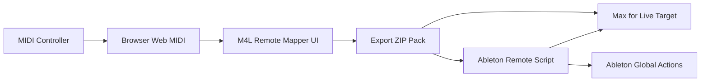
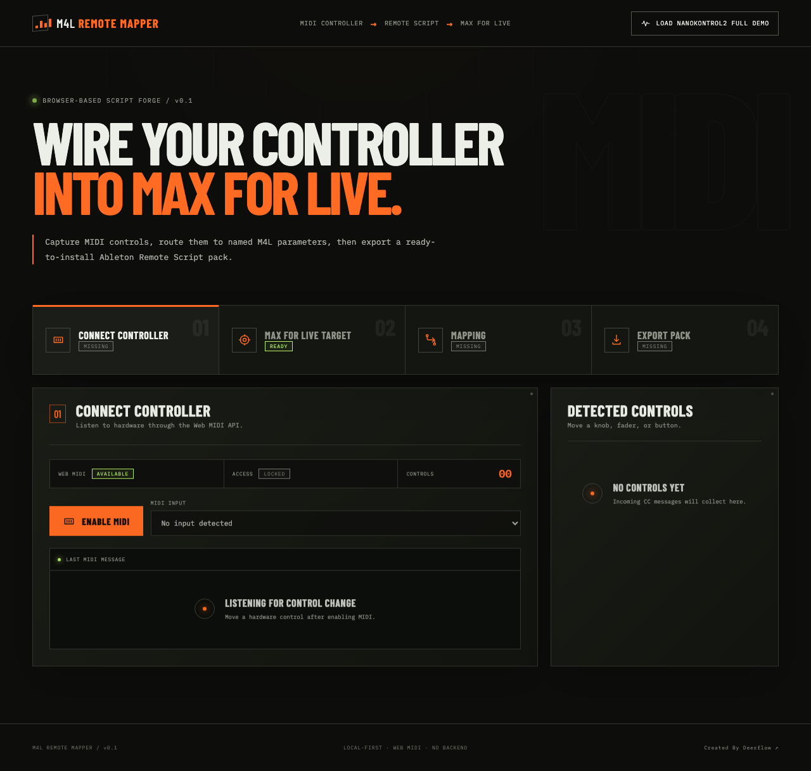
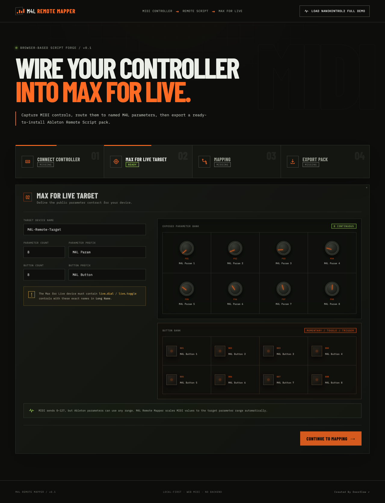
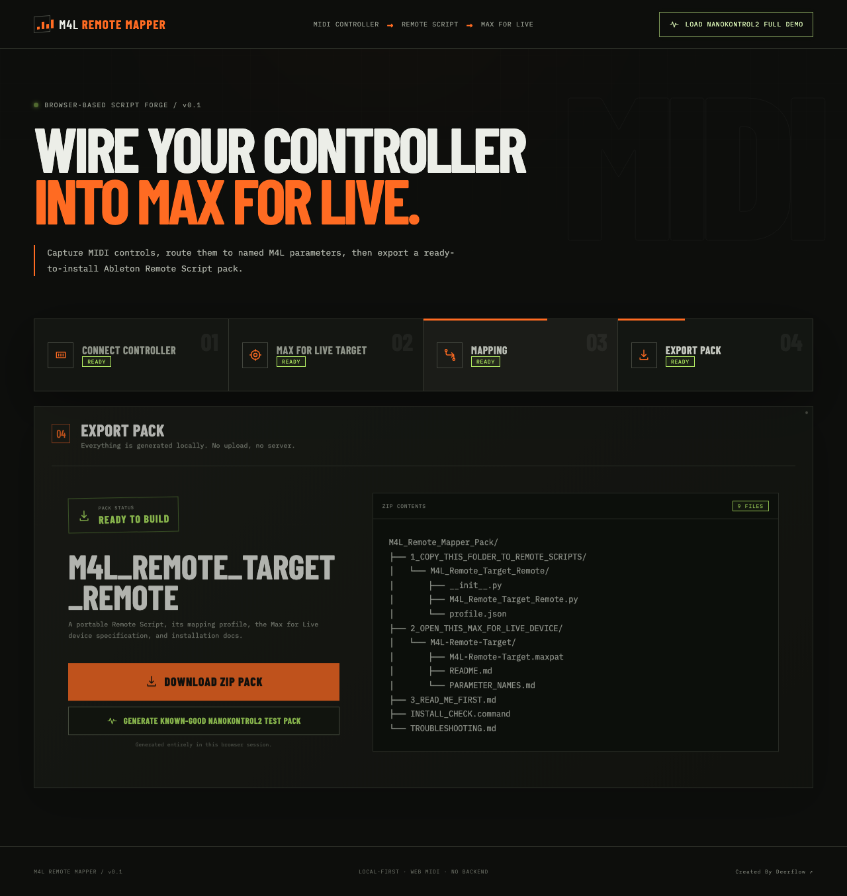
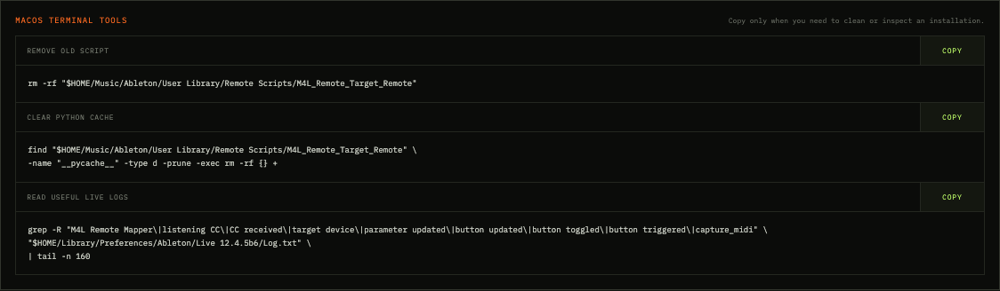

# M4L Remote Mapper

Create installable Ableton Remote Scripts for Max for Live from your browser.

[](https://react.dev/)
[](https://vite.dev/)
[](https://www.ableton.com/live/)
[](https://www.ableton.com/live/max-for-live/)
[](https://developer.mozilla.org/docs/Web/API/Web_MIDI_API)
[](tests/)
[](LICENSE)

[Français](README.fr.md) · [Ableton installation](docs/ABLETON_INSTALLATION.md) · [Troubleshooting](docs/TROUBLESHOOTING.md) · [Development](docs/DEVELOPMENT.md)


M4L Remote Mapper is a browser-based tool that lets you capture MIDI CC messages from a hardware controller, map them to Max for Live parameters, buttons, or Ableton global actions, and export a ready-to-install Ableton Remote Script pack.

It runs locally in the browser. There is no required backend, no account, and no MIDI data upload.

## What is M4L Remote Mapper?

M4L Remote Mapper turns a controller layout into two things that work together:

1. An Ableton Remote Script that listens to the configured MIDI CC messages.
2. A Max for Live target template with matching continuous and button parameters.

The app captures MIDI through the Web MIDI API, helps you describe each mapping, generates the Python Remote Script, includes installation diagnostics, and downloads everything as one ZIP.

It is useful when you are building a custom Max for Live device and want a controller mapping that can be installed, reused, documented, and debugged without writing Remote Script boilerplate by hand.

## Why?

Ableton's regular MIDI mapping is excellent for quick set-specific assignments, but reusable custom control surfaces need more structure. Remote Scripts are powerful, yet their Python API, MIDI forwarding, parameter naming, and installation details are easy to get wrong.

Max for Live adds another constraint: the names exposed to Live must match what the script resolves. A mismatch between Long Name, Short Name, or parameter order can silently route a control to the wrong target.

M4L Remote Mapper handles that plumbing:

- generates `_Framework.EncoderElement` listeners for every CC;
- keeps parameter aliases for Long Name, Short Name, and Max Scripting Name;
- separates continuous controls from buttons;
- disables index fallback by default and type-checks it when explicitly enabled;
- scales MIDI values to the actual Ableton parameter range;
- generates readable logs, a deterministic `BUILD_ID`, and an installation checker.

## How it works



The generated Python uses `EncoderElement` and `add_value_listener`; it does not rely on `receive_midi` as its primary mechanism. It does not use `DeviceComponent`, `set_device_component`, or `self.log_message`.

## Features

- Web MIDI CC capture
- Continuous controls with parameter min/max scaling
- MIDI button mappings
- Momentary, Input Toggle, Script Toggle, and Trigger modes
- Long Name, Short Name, and Max Scripting Name aliases
- Strict continuous/button compatibility checks
- Index fallback disabled by default
- Optional type-safe index fallback in Advanced
- Ableton Capture MIDI global action
- Browser-side ZIP generation
- Guided post-export Setup Wizard
- Double-clickable macOS `INSTALL_CHECK.command`
- Troubleshooting and focused Log.txt commands
- Known-good nanoKONTROL2 test pack
- Transparent stereo Max Audio Effect target template
- Separate Ableton Device Mapper for native Live instruments and effects
- Visual M4L Custom Layout step with live knobs, faders, buttons, Learn MIDI, targets, and latch modes
- Live 12.4.5b6 catalog with 83 devices and 2,746 parameters

## Ableton Device Mapper

Open `/ableton-device-mapper` or select **Ableton Device Mapper** in the top navigation to build a Remote Script for a native Live device such as Operator, Wavetable, Drift, Simpler, Auto Filter, EQ Eight, Roar, Hybrid Reverb, or Arpeggiator.

The integrated six-step builder includes a visual **Custom Layout** creator with live MIDI knobs, faders, and buttons. Use the visible **UI · NORMAL / TERMINAL** switch in the header to change renderer without losing the current layout or assignments.

Unlike the Max for Live workflow, this mode requires no target patch. Choose a device and one of its catalogued parameters, apply a controller layout, then export `Ableton_Device_Mapper_Pack`. The generated script searches the selected track first, then all tracks, return tracks, nested rack chains, and the master track. Devices resolve by user-visible name or Live class name.

The known Operator Musical 8 layout starts with:

| MIDI source | Operator parameter |
| --- | --- |
| CC16 | Volume |
| CC17 | Tone |
| CC18 | Filter Freq |
| CC19 | Filter Res |

Parameter aliases are matched before an optional catalog index. Fallback remains disabled by default, and continuous values are scaled through the native parameter's reported minimum and maximum.

See [Ableton Device Mapper](docs/ABLETON_DEVICE_MAPPER.md) for its catalog contract, presets, generated ZIP, and installation workflow.

## Screenshots

| Step | Preview |
| --- | --- |
| Connect Controller |  |
| Max for Live Target |  |
| Mapping Matrix |  |
| Export Pack |  |
| Setup Wizard |  |
| Installation tools |  |

See [docs/SCREENSHOTS.md](docs/SCREENSHOTS.md) to regenerate these images.

## Quick start

You need Node.js, a Chromium-based browser with Web MIDI support, Ableton Live with Max for Live, and a MIDI controller.

```bash
cd client
npm install
npm run dev
```

Then:

1. Open the local URL printed by Vite.
2. Click **Enable MIDI** and allow MIDI access.
3. Select the controller input.
4. Move knobs, sliders, or buttons to capture their CC messages.
5. Define the Max for Live target names.
6. Map continuous controls, buttons, and optional global actions.
7. Export the ZIP.
8. Follow the Setup Wizard and `3_READ_ME_FIRST.md` inside the pack.

If you want to verify installation before making a custom profile, use **Generate Known-Good nanoKONTROL2 Test Pack**.

## Installation in Ableton

The exported archive is intentionally explicit:

```text
M4L_Remote_Mapper_Pack/
├── 1_COPY_THIS_FOLDER_TO_REMOTE_SCRIPTS/
│   └── M4L_Remote_Target_Remote/
│       ├── __init__.py
│       ├── M4L_Remote_Target_Remote.py
│       └── profile.json
├── 2_OPEN_THIS_MAX_FOR_LIVE_DEVICE/
│   └── M4L-Remote-Target/
│       ├── M4L-Remote-Target.maxpat
│       ├── README.md
│       └── PARAMETER_NAMES.md
├── 3_READ_ME_FIRST.md
├── INSTALL_CHECK.command
└── TROUBLESHOOTING.md
```

Do **not** copy the whole ZIP or the numbered parent folder into Ableton.

Copy only:

```text
1_COPY_THIS_FOLDER_TO_REMOTE_SCRIPTS/M4L_Remote_Target_Remote/
```

to:

```text
~/Music/Ableton/User Library/Remote Scripts/
```

The installed result must be:

```text
~/Music/Ableton/User Library/Remote Scripts/M4L_Remote_Target_Remote/
├── __init__.py
├── M4L_Remote_Target_Remote.py
└── profile.json
```

Remove older folders with the same script name, remove `__pycache__`, and restart Ableton Live.

### Ableton Preferences

Open **Preferences/Settings → Link, Tempo & MIDI** and configure a Control Surface slot:

| Setting | Value |
| --- | --- |
| Control Surface | `M4L_Remote_Target_Remote` |
| Input | Your controller input, for example `nanoKONTROL2 SLIDER/KNOB` |
| Output | `None` |

Remote Scripts are discovered at startup, so restart Live after replacing the folder.

For the complete walkthrough, see [Ableton installation](docs/ABLETON_INSTALLATION.md).

## Max for Live target device

Open:

```text
2_OPEN_THIS_MAX_FOR_LIVE_DEVICE/M4L-Remote-Target/M4L-Remote-Target.maxpat
```

from a Max Audio Effect, save it if needed, and load it into Live. The loaded device must be named exactly:

```text
M4L-Remote-Target
```

The default template exposes:

- `M4L Param 1` through `M4L Param 8`
- `M4L Button 1` through `M4L Button 8`

Long Name and Short Name are both complete and identical. The script also recognizes aliases:

```text
M4L Param 1
Param 1
m4l_param_1
```

Button aliases follow the same pattern: `M4L Button 1`, `Button 1`, `m4l_button_1`.

Custom prefixes are supported. The naming rule is always: trimmed prefix, one space, one-based slot number. `M4L-Param` therefore becomes `M4L-Param 1`, never `M4L-Param-1`.

See [Max for Live target](docs/MAX_FOR_LIVE_TARGET.md).

## MIDI value scaling

MIDI sends integers from 0 to 127, but Ableton parameters can use any range. M4L Remote Mapper converts:

```text
MIDI 0–127
→ normalized 0.0–1.0
→ parameter.min–parameter.max
```

Examples:

| Target parameter | MIDI value 64 becomes |
| --- | ---: |
| M4L dial `0.0–1.0` | about `0.504` |
| Integer parameter `0–127` | about `64` |
| Frequency `20–20000` | about the midpoint of that parameter range |

The generated script does not blindly write 0–127. It writes a value scaled to the target parameter's actual minimum and maximum.

## Button modes

### Momentary

Press writes `parameter.max`; release writes `parameter.min`. Typical input: 127 on press, 0 on release.

### Input Toggle

Follows the controller value. A non-zero value is ON; zero is OFF. Use this when the controller already maintains toggle state.

### Script Toggle

Each value-127 press flips an internal ON/OFF state. Release value 0 is ignored. Use this for momentary hardware that should behave like a toggle.

### Trigger

Fires once at value 127 and ignores release. This is used for Capture MIDI and one-shot global actions or pulses.

## Safe parameter resolution

The generated script resolves each target in this order:

1. exact match against all aliases;
2. normalized match against all aliases;
3. optional index fallback, only when explicitly enabled.

Every candidate must also match the expected kind. A continuous mapping rejects names containing `Button`; a button mapping requires a button-compatible name. Index fallback is off by default because Max for Live does not guarantee exposed parameter order.

Keep **Allow index fallback if name is missing** disabled unless you have a specific reason to use it.

## Known-good nanoKONTROL2 demo

The test pack uses MIDI channel 1 (framework channel 0):

| CC | Target | Mode |
| ---: | --- | --- |
| 16 | M4L Param 1 | Continuous |
| 17 | M4L Param 2 | Continuous |
| 18 | M4L Param 3 | Continuous |
| 19 | M4L Param 4 | Continuous |
| 32 | M4L Button 1 | Script Toggle |
| 33 | M4L Button 2 | Script Toggle |
| 34 | M4L Button 3 | Momentary |
| 35 | M4L Button 4 | Momentary |
| 45 | Capture MIDI | Trigger at value 127 |

Use this pack to separate installation problems from custom-profile problems.

## Troubleshooting

### Nothing moves

- Confirm the generated Control Surface is selected.
- Confirm the correct MIDI Input port is selected.
- Set Output to `None`.
- Remove old duplicate script folders and `__pycache__`.
- Restart Ableton Live.
- Run `INSTALL_CHECK.command` on macOS.

### Slider controls a button

This normally indicates an old script with unsafe index fallback or mismatched Max names. Install the latest pack, keep index fallback disabled, and verify both Long Name and Short Name.

### `target device missing`

The loaded device name does not match. It must be exactly `M4L-Remote-Target` unless your generated profile uses another target name.

### `parameter missing by aliases`

The exposed names do not match any generated alias. Check the complete names in Max and compare them with `profile.json` and the `available parameters` log line.

### Old `self.log_message` error

An old Remote Script is still installed or cached. Delete the old folder, reinstall a fresh ZIP, remove `__pycache__`, and restart Live.

### Capture MIDI does not work

- Confirm CC45 sends exactly 127.
- Make sure a MIDI track has material available to capture.
- Look for `capture_midi requested`, `capture_midi success`, or `capture_midi error` in Log.txt.

### Read useful Live logs on macOS

```bash
grep -R "BUILD_ID\|M4L Remote Mapper\|script loaded\|CC received\|parameter found\|parameter missing\|available parameters\|fallback disabled\|unsafe fallback\|parameter updated\|button updated\|capture_midi" \
"$HOME/Library/Preferences/Ableton/Live 12.4.5b6/Log.txt" \
| tail -n 220
```

The startup line includes a deterministic `BUILD_ID`, which confirms exactly which generated profile Live loaded.

### Clean reinstall on macOS

Quit Live first:

```bash
rm -rf "$HOME/Music/Ableton/User Library/Remote Scripts"/M4L_Remote_Target_Remote*

find "$HOME/Music/Ableton/User Library/Remote Scripts" \
-name "__pycache__" -type d -prune -exec rm -rf {} +
```

Then copy one fresh generated folder and restart Live. More cases are documented in [Troubleshooting](docs/TROUBLESHOOTING.md).

## Development

```bash
cd client
npm install
npm run dev
npm run build
```

From the repository root:

```bash
npm install
npm test
npm --prefix client run build
npm run docs:screenshots
```

The screenshot command starts Vite, opens Chromium through Playwright, loads the known-good demo, and updates `docs/assets/`.

## Project structure

```text
client/                 React/Vite browser application
maxforlive/             Canonical Max for Live target template
docs/                   Installation, architecture, troubleshooting, assets
scripts/                Documentation screenshot automation
tests/                  Generator, ZIP, Python, and safety tests
```

## Limitations

- A browser cannot install files directly into Ableton's Remote Scripts folder; copying is manual.
- Ableton must be restarted after installing or replacing a Remote Script.
- Web MIDI support depends on the browser; Chromium-based browsers are the primary target.
- The current workflow is tested primarily on macOS, Ableton Live 12.4 beta, and nanoKONTROL2.
- The generated Python approach should be portable, but Windows installation paths and controller port names differ and are not yet tested as thoroughly.
- Ableton's Remote Script API is not a stable public API and may change between Live versions.

## Roadmap

- More controller templates
- Launch Control XL template
- Akai MIDImix template
- Import/export mapping presets
- More Ableton global actions
- Visual controller layouts
- GitHub Pages or Vercel deployment
- Optional Max for Live device generation

## Contributing

Issues and focused pull requests are welcome. Please read [CONTRIBUTING.md](CONTRIBUTING.md) before submitting changes.

## License

Released under the [MIT License](LICENSE).

Ableton, Ableton Live, Max, and Max for Live are trademarks of their respective owners. This project is independent and is not affiliated with or endorsed by Ableton.
